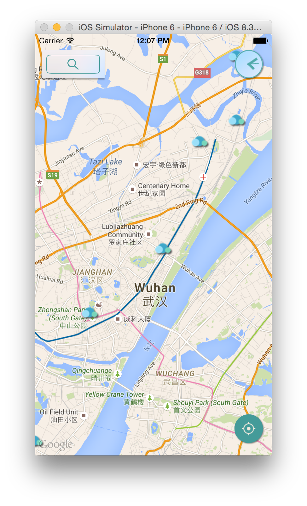
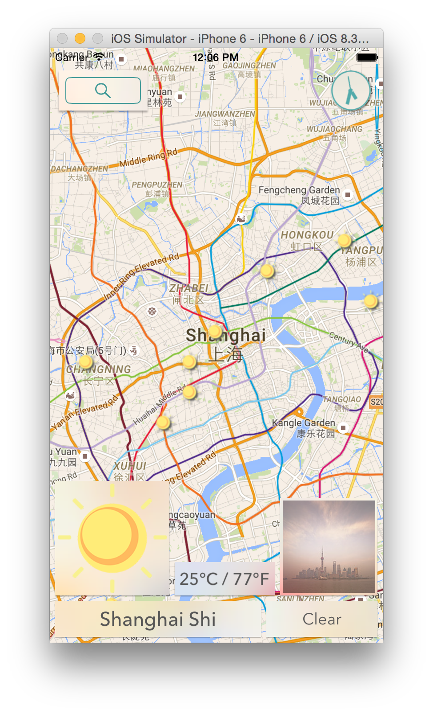
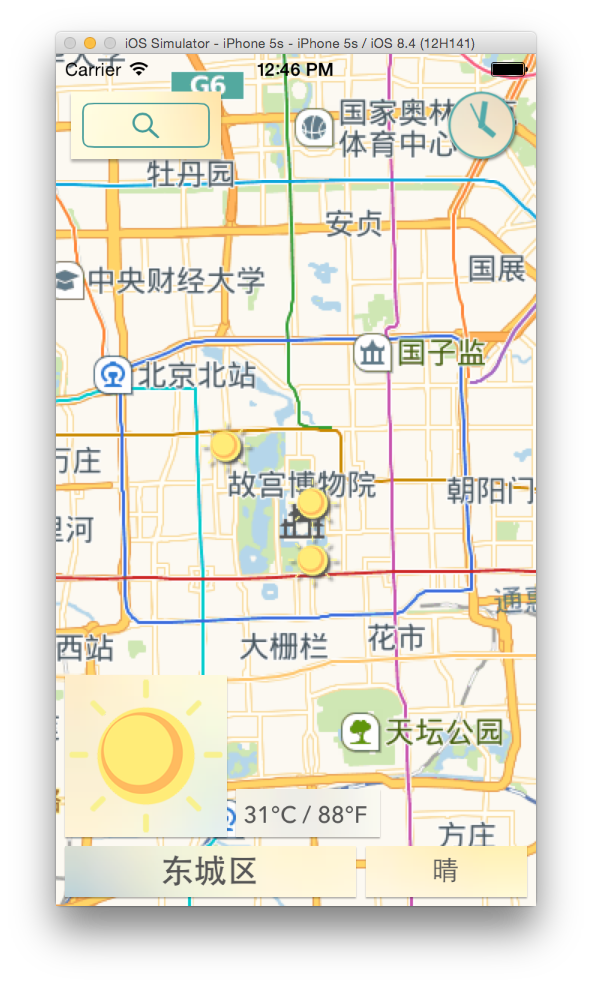
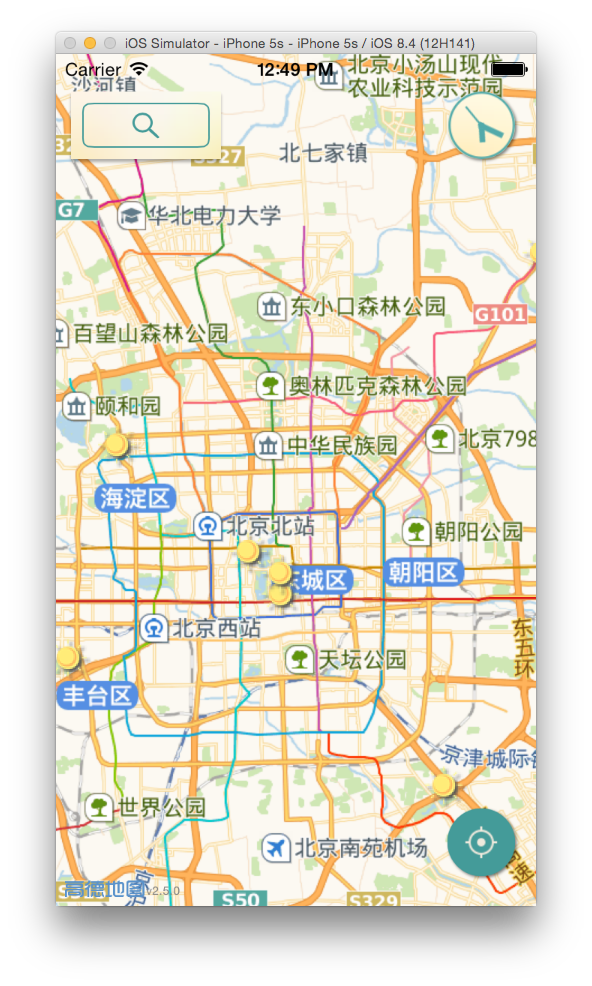

# Weather Map - [Takefive Interactive](http://takefiveinteractive.com)
WeatherMap combines weather info with map display. You can view the ongoing weather change of an entire region in one scroll! It is a tool designed for those of you who road-trip or travel around often.

**Now the ```master``` branch contains both Gaode Map & Google Map!**








## Usage
1) Download the repository
```fish
git clone https://github.com/TakefiveInteractive/WeatherMap.git
cd WeatherMap
```
  For checkout the ```ChinaVersion```

```fish
git checkout ChinaVersion
```

2) Install pods
```fish
cd WeatherAroundUs
pod install
```

3) Open the workspace
```fish
open WeatherMap.xcworkspace
```

3) Compile and run the app in simulator
* Under Xcode, press ``Ctrl + R``

## Requirements
* Xcode 6.3
* iOS 8

## Download:
Now Weather Map version 2.2.0 is available in App Store.


[Weather Map iTunes page](https://itunes.apple.com/us/app/weather-map-take-five-interactive/id990141529?mt=8)

## Credits
* [Alamofire](https://github.com/Alamofire/Alamofire) for network request
* [SwiftyJSON](https://github.com/SwiftyJSON/SwiftyJSON) for handling JSON api
* [Spring](https://github.com/MengTo/Spring) for code-less animation
* [FMDB](https://github.com/ccgus/fmdb) for data storing
* [GPUImage](https://github.com/BradLarson/GPUImage) for image handling
* [HanekeSwift](https://github.com/Haneke/HanekeSwift) for cache
* [Shimmer](https://github.com/facebook/Shimmer) for animation

## Donation:
 *Paypal or Alipay* 

